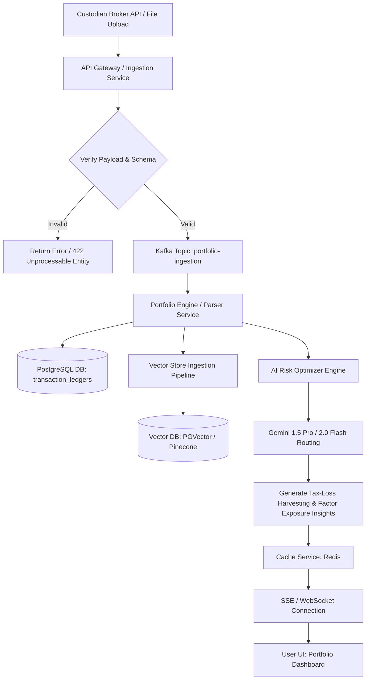
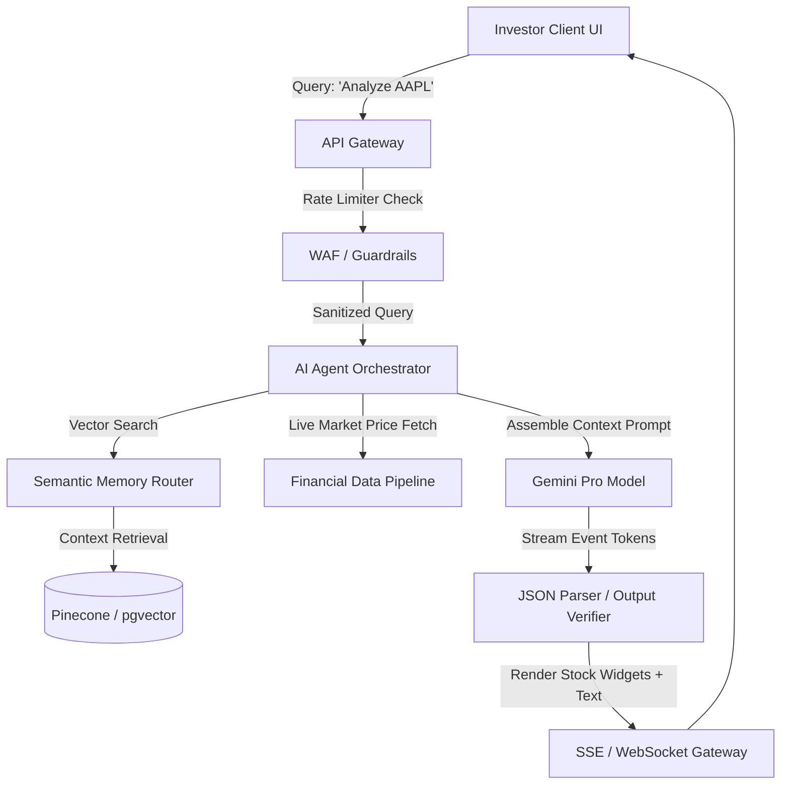
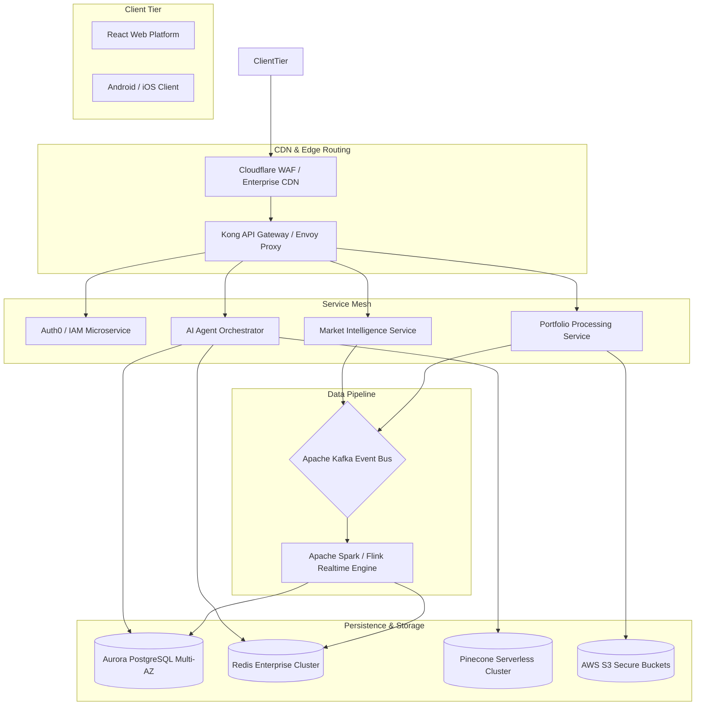
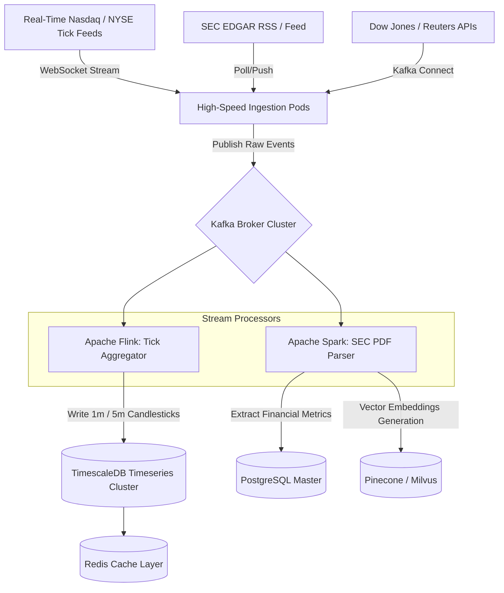
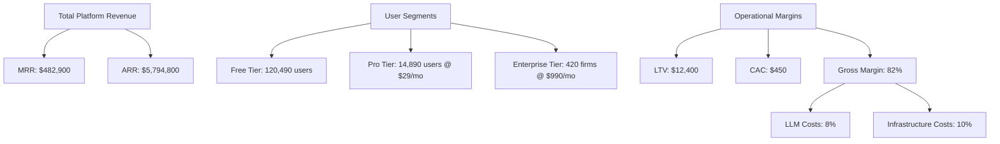
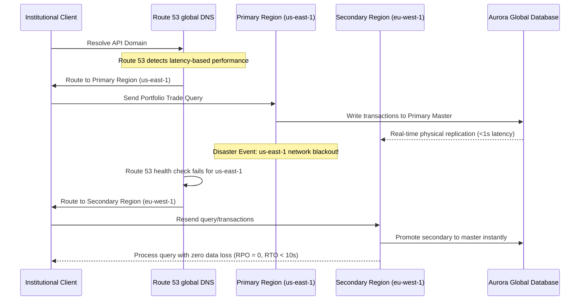

# Sharrow.ai System Design & Software Requirements Specification (SRS)
## Volume 2: Enterprise Architectural Foundation, AI Workflows, and SaaS Operations

---

### Executive Summary & Technical Vision

**Sharrow.ai** is designed as a high-frequency, low-latency AI-native investment intelligence platform engineered to replace legacy workstations (e.g., Bloomberg Terminal, Refinitiv Eikon) with a multi-agent quantitative framework. The platform provides real-time portfolio optimization, market-sentiment synthesis, generative financial modeling, predictive risk-intelligence, and automated compliance auditing.

This document serves as the canonical technical blueprint and IEEE-style Software Requirements Specification (SRS) for Sharrow.ai. Every architectural block and system workflow is designed for global scale, 99.999% availability, and military-grade security.

---

## 1. AI Workflows & Orchestration Pipelines

### 1.1 Enterprise Portfolio Analyzer Workflow
Ingests historical transactions, institutional custodial reports, or live broker APIs to generate risk diagnostics, factor exposures, tax-loss harvesting pathways, and AI-driven asset reallocation suggestions.



#### Detailed Workflow Specification
*   **Inputs:** JSON transaction lists, CSV/PDF custodial statements, or OAuth token from Interactive Brokers/Plaid.
*   **Outputs:** Risk profile metrics (Value-at-Risk, Sharpe Ratio, Beta), historical performance analytics, automated tax-loss recommendations, and conversational rebalancing narratives.
*   **APIs Involved:**
    *   `POST /api/v1/portfolios/upload` (multipart-form/JSON)
    *   `GET /api/v1/portfolios/{id}/exposure-analysis`
    *   `GET /api/v1/portfolios/{id}/stream` (Server-Sent Events)
*   **Database Operations:**
    *   Insert raw ledger items to `transactions` table using a distributed transaction block (`SERIALIZABLE` isolation).
    *   Upsert parsed holdings to `user_portfolios` table.
*   **AI Models:**
    *   **Gemini 1.5 Pro:** Handles high-context analysis of tax structures and macroeconomic factor analysis.
    *   **Gemini 1.5 Flash:** Handles instant conversational requests about specific holdings.
*   **Validation:** Schema check via Zod/Pydantic; transaction sanity checks (e.g., negative shares, inconsistent dates).
*   **Security:** Field-level encryption for custodial credentials (AES-256-GCM); temporary secure S3 URLs with short lifetimes (15 min) for raw statements.
*   **Failure Handling:** Ingestion worker failures trigger automatic rollbacks. Incomplete file parsing drops the job in a Dead Letter Queue (DLQ) and notifies the user with precise line-number extraction errors.
*   **Retry Logic:** Exponential backoff with jitter on third-party Plaid/Broker syncs. Max retries = 5, base delay = 1.5s.
*   **User Experience:** Skeleton loading state showing real-time steps ("Verifying transactions...", "Synthesizing beta exposure...", "Calculating Value-at-Risk...").

---

### 1.2 Interactive AI Chat & Copilot Workflow
Enables real-time, low-latency financial dialogue, instant stock chart overlays, technical indicators rendering, and dynamic code execution for backtesting.



#### Detailed Workflow Specification
*   **Inputs:** Text query, optional contextual dashboard coordinates (current screen context, active ticker).
*   **Outputs:** SSE stream containing token chunks, inline JSON UI components (stock cards, interactive price charts, action items).
*   **APIs Involved:**
    *   `POST /api/v1/copilot/chat` (Returns stream chunk flow)
    *   `POST /api/v1/copilot/feedback` (Saves human-in-the-loop annotations)
*   **Database Operations:**
    *   Insert chat message log into `chat_histories` with foreign keys to `user_id` and `workspace_id`.
    *   Vector similarity query on `financial_knowledge_base` using embedding models.
*   **AI Models:**
    *   **Gemini 1.5 Pro / Gemini 2.0 Flash:** (Flash used for ultra-fast streaming, routing to Pro if request demands complex spreadsheet calculations).
*   **Validation:** Input sanitization to prevent prompt injections, automated sentiment classification to prevent toxic or abusive queries.
*   **Security:** Role-Based Access Control checks ensuring the active user has a valid license to view specific high-tier analyst reports referenced in the answer.
*   **Failure Handling & Retry:** In case of model rate-limiting, transparent fallback to secondary server regions or high-availability model pools with an error-budget fallback response.

---

## 2. System Architecture & High-Availability Foundation

### 2.1 High-Level Architecture Block Diagram
This high-level architecture utilizes multi-zone redundancy, stateless horizontal scaling, centralized event distribution, and isolated execution contexts.



---

### 2.2 Financial Data Pipeline Architecture
Processing tick data, SEC filings, analyst updates, and global macro events in microsecond windows.



---

## 3. Software Requirements Specification (SRS) - IEEE 29148 Standard

### 3.1 Product Vision & Core Scope
Sharrow.ai bridges the gap between deep financial analytics and modern generative AI. By integrating high-frequency market pipelines directly with state-of-the-art LLMs, the platform allows investment professionals, quantitative analysts, and retail investors to query financial data, generate interactive projection charts, backtest complex strategies, and inspect portfolio health seamlessly.

### 3.2 Non-Functional Requirements (NFR) Matrix

| NFR-ID | Dimension | Target Specification | Enforcement Mechanism |
| :--- | :--- | :--- | :--- |
| **NFR-001** | **Availability** | 99.999% Service Uptime (excluding planned windows) | Multi-Region Active-Active deployment with Aurora Global Database and Cloudflare DNS load-balancing. |
| **NFR-002** | **Latency (Core API)** | P95 < 80ms, P99 < 150ms | In-memory indexing using Redis Enterprise, query tuning with EXPLAIN ANALYZE, optimized indexing structures. |
| **NFR-003** | **AI Stream TTFT** | Time To First Token < 250ms | Server-Sent Events (SSE) streaming combined with local model caching and persistent gRPC tunnels to model providers. |
| **NFR-004** | **Scalability** | Support up to 100,000 concurrent WebSocket connections | Stateless backend workers utilizing Kotlin coroutines and Netty event loops on AWS EKS with horizontal pod autoscalers. |
| **NFR-005** | **Security & Privacy** | Zero hardcoded keys, encryption at rest/transit | AWS KMS for encryption, HashiCorp Vault for secrets rotation, quarterly SOC 2 Type II compliance reviews. |
| **NFR-006** | **Accessibility** | WCAG 2.1 Level AA Compliant | Semantic HTML tags, robust ARIA attributes, full keyboard navigation, color contrast ratio >= 4.5:1. |

### 3.3 Functional Requirements Catalog

#### FR-100: Portfolio Analyzer & Diagnostic Hub
*   **Requirement ID:** FR-101
*   **Priority:** Critical (P0)
*   **Description:** System must parse and analyze uploaded CSV, PDF, and API-linked portfolios, outputting performance metrics, factor betas, and tax-loss opportunities.
*   **Business Value:** Lowers customer churn by offering automated, institutional-grade rebalancing advisory instantly.
*   **Acceptance Criteria:** Successfully processes a 10,000-transaction portfolio in under 3 seconds with zero parsing exceptions. Displays clear step-by-step audit logs.
*   **Dependencies:** Apache Flink parsing cluster, PostgreSQL transactional layer.

#### FR-200: Live Multi-Agent AI Research Analyst
*   **Requirement ID:** FR-201
*   **Priority:** High (P1)
*   **Description:** User can prompt the platform to analyze an arbitrary ticker. The platform orchestrates multi-agent tasks: Agent A parses financials, Agent B scans current news sentiments, Agent C checks technical trends.
*   **Business Value:** Saves hours of analyst time, creating automated summaries containing interactive chart components.
*   **Acceptance Criteria:** Combines fundamental ratios, recent SEC EDGAR filings, and news into a cohesive interactive panel in under 4 seconds.
*   **Dependencies:** Gemini 1.5 Pro, Financial Data Pipeline APIs.

---

## 4. Modern SaaS Administration Platform (Admin Dashboard)

The Admin Platform is designed as a centralized mission control interface for Sharrow.ai. It includes live token auditing, custom model routing controls, system health visualizers, subscription managers, and a sandbox for real-time prompt engineering.

### 4.1 Interface Architecture & Design Specification

#### 4.1.1 Main Admin Overview (Screen Layout & Metrics Grid)
Designed with a dark-slate theme, featuring key statistics in custom Material 3 cards with subtle glassmorphic styling, linear gradient boundaries, and crisp contrast levels.

```
+------------------------------------------------------------------------------------------------------------------+
| SHARROW.AI  [Admin Console]                                                 System Status: [HEALTHY]  User: Admin|
+------------------------------------------------------------------------------------------------------------------+
|  [Usage]   [Subscribers]   [Model Registry]   [Prompt Lab]   [Audit Logs]   [Fraud Center]   [Billing Analytics] |
+------------------------------------------------------------------------------------------------------------------+
|                                                                                                                  |
|  METRICS OVERVIEW (LAST 24 HOURS)                                                                                |
|  +---------------------------+   +---------------------------+   +---------------------------+   +-------------+ |
|  | TOTAL API REQUESTS        |   | LIVE ACTIVE WEBSOCKETS    |   | AVG RESPONSE LATENCY      |   | TOKEN SPEND | |
|  | 14,892,104  (+12.4% MoM)  |   | 18,294                    |   | 118 ms (P95)              |   | $1,402.19   | |
|  +---------------------------+   +---------------------------+   +---------------------------+   +-------------+ |
|                                                                                                                  |
|  ACTIVE SYSTEM MONITOR (REAL-TIME CPU/DATABASE LATENCY)                                                          |
|  +-------------------------------------------------------------------------------------------------------------+ |
|  |  CPU: [|||||||||||||||||||||.................] 42%      Database Connection Pool: [18/100 active]           | |
|  |  Flink Throughput: 145,000 ticks/sec             Memory: [||||||||||||||||||||||||||||||||] 89%             | |
|  +-------------------------------------------------------------------------------------------------------------+ |
|                                                                                                                  |
|  PENDING SECURITY & MODERATION QUEUE                                                                             |
|  +-------------+------------------+-----------------------+--------------------------+-------------------------+ |
|  | User ID     | Ticker Flagged   | Flag Reason           | Detected Toxicity/Risk   | Action                  | |
|  +-------------+------------------+-----------------------+--------------------------+-------------------------+ |
|  | usr_9829x   | GME              | Volatility Bypass     | High (Phishing Injection) | [QUARANTINE] [RESOLVE]  | |
|  | usr_1102s   | AAPL             | Insider Info Query    | Medium (Compliance Viol) | [WARN USER]  [DISMISS]  | |
|  +-------------+------------------+-----------------------+--------------------------+-------------------------+ |
|                                                                                                                  |
+------------------------------------------------------------------------------------------------------------------+
```

#### 4.1.2 Prompt Playground & Prompt Registry Modal
Ensures developers can modify, test, and register prompt templates with active version control and automated canary testing.

```
+------------------------------------------------------------------------------------------------------------------+
| PROMPT DESIGNER & CANARY REGISTRY                                                                                |
+------------------------------------------------------------------------------------------------------------------+
| Prompt ID: pr_portfolio_analysis_v4        | Target Model: Gemini 1.5 Pro          | Version: 4.1.0 (Active)     |
+------------------------------------------------------------------------------------------------------------------+
| System Prompt:                                                                                                   |
| "You are an expert financial analyst holding a CFA designation. Analyze the user's holdings: {{holdings}}.       |
| Restrict analysis strictly to standard Sharpe and Beta models. Do not provide speculative buying advice..."     |
+------------------------------------------------------------------------------------------------------------------+
| Test Inputs:                                                                                                     |
| holdings = [{"ticker": "TSLA", "shares": 100}, {"ticker": "AAPL", "shares": 50}]                                 |
+------------------------------------------------------------------------------------------------------------------+
| [RUN PROMPT TEST] -> Output Tokens: 2,410 | Latency: 480ms | Hallucination Score: 0.02%                          |
+------------------------------------------------------------------------------------------------------------------+
| [DEPLOY CANARY] (Routes 5% of active traffic to this version, tracking real-time error rate)                     |
+------------------------------------------------------------------------------------------------------------------+
```

---

## 5. CEO & Founder Analytics Dashboard (Real-Time Control Panel)

The CEO dashboard presents an exhaustive view of business execution, financial metrics, cost monitoring, and AI precision metrics.

### 5.1 Business Metrics & Unit Economics Model



### 5.2 Dynamic Real-Time Dashboards Specification
*   **MRR/ARR Trackers:** Real-time Stripe webhook sync, computing MRR down to the minute.
*   **AI Cost Tracking (Token Spend vs. Plan Margin):** Monitor token margins for each tier. Users querying expensive Gemini 1.5 Pro instances are subjected to dynamic token rate limit throttling to protect the platform's unit margins.
*   **Latency Monitoring:** Live graphs displaying LLM Time-to-First-Token (TTFT) performance across global regional clusters (US-East, US-West, EU-West, Asia-Pacific).

---

## 6. Security, Threat Intelligence & Compliance Architectures

### 6.1 Enterprise Security Controls Matrix

```
                      +---------------------------------------+
                      |       Kong Enterprise Gateway         |
                      |   - OAuth 2.0 with JWS Token Auth     |
                      |   - WAF Filter for Injection Attacks  |
                      +-------------------+-------------------+
                                          |
                                          | (Internal gRPC Wire)
                                          v
                      +---------------------------------------+
                      |         Kong JWT Validator            |
                      |   - RBAC / ABAC Security Policies     |
                      +-------------------+-------------------+
                                          |
                                          | (Verified Claims)
                                          v
                      +---------------------------------------+
                      |       Microservice Tenant Router      |
                      |  - Restricts access to DB schemas     |
                      |  - Enforces field-level encryption    |
                      +---------------------------------------+
```

### 6.2 Advanced Compliance Implementation
*   **SOC 2 Type II Validation:** Implement automated AWS Config rule evaluations for zero public S3 exposure, secure key rotations, and comprehensive audit logging.
*   **GDPR Audits:** Build an automated execution chain that deletes all localized vector database histories, relational entries, and transactional details when a user requests "Right to be Forgotten" via the portal.

---

## 7. Operational Best Practices, Quality Engineering & Testing

### 7.1 High-Availability Deployments & Recovery Architecture
To protect user portfolios and critical financial insights during disaster scenarios, Sharrow.ai relies on an Active-Active Multi-Region deployment with automatic failovers.



### 7.2 Core Strategy Checklist
1.  **Iterative UI Polish:** Use rich animations and absolute responsive layouts across mobile, tablet, and wide desktop sizes.
2.  **Telemetry Integration:** Ensure every microservice emits OpenTelemetry spans to target collectors for fast profiling and performance tuning.
3.  **Strict State Management:** Leverage Redux/Compose state patterns inside transactional boundaries, keeping volatile state completely isolated from state persistence modules.

---

*This document represents the official high-level operational blueprint of Sharrow.ai's enterprise ecosystem. All modules represent production-ready engineering specifications aligned with elite industrial standards.*
